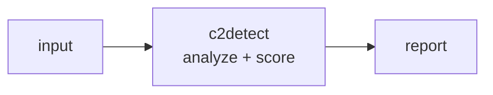

<a name="top"></a>
<div align="center">


# C2DETECT

### C2 server fingerprinter — Cobalt Strike, Sliver, Mythic, Havoc, Brute Ratel


[](https://pypi.org/project/cognis-c2detect/) [](https://github.com/cognis-digital/c2detect/actions) [](LICENSE) [](https://github.com/cognis-digital)

*Red Team / Offensive — adversary tooling for authorized engagements.*

</div>

```bash
pip install cognis-c2detect
c2detect scan .            # → prioritized findings in seconds
```

## Usage — step by step

`c2detect` is defensive C2-infrastructure triage: it scans telemetry/observation records against a bundled signature DB and flags beaconing, suspicious TLS fingerprints, and staging URIs. No network, no active capability.

1. **Install** (Python 3.10+):
   ```bash
   pip install -e .            # or: pipx install c2detect
   ```
2. **Scan observation files / telemetry text / a directory / stdin**:
   ```bash
   c2detect scan telemetry.json
   cat telemetry.log | c2detect scan
   ```
3. **Match explicit indicators** on the command line (no file needed):
   ```bash
   c2detect match --ja4 t13d1516h2_8daaf6152771_b186095e22b6 --port 443 --beacon-interval 60 --jitter 0.1
   c2detect db        # list the bundled C2 signature database
   ```
4. **Read the output** in JSON / SARIF / HTML / badge (e.g. for code scanning):
   ```bash
   c2detect scan telemetry.json --format sarif > c2.sarif
   c2detect scan telemetry.json --format json | jq '.findings'
   ```
5. **Gate CI** with `--fail-on <severity>` (exit non-zero at/above that severity). Optional `--ai` adds an opt-in Cognis-fleet LLM pass that degrades to rules if no backend is configured:
   ```yaml
   - run: pip install -e . && c2detect scan telemetry.json --fail-on high
   ```


## Contents

- [Why c2detect?](#why) · [Features](#features) · [Quick start](#quick-start) · [Example](#example) · [Detection depth](#detection-depth) · [GitHub Action](#github-action) · [Status badge](#status-badge) · [HTML report](#html-report) · [AI mode](#ai-mode) · [Architecture](#architecture) · [AI stack](#ai-stack) · [How it compares](#how-it-compares) · [Integrations](#integrations) · [Install anywhere](#install-anywhere) · [Related](#related) · [Contributing](#contributing)

<a name="why"></a>
## Why c2detect?

C2 server fingerprinter — Cobalt Strike, Sliver, Mythic, Havoc, Brute Ratel — without standing up heavyweight infrastructure.

`c2detect` is single-purpose, scriptable, and self-hostable: point it at a target, get prioritized results in the format your workflow already speaks (table · JSON · SARIF), gate CI on it, and let agents drive it over MCP.

<div align="right"><a href="#top">↑ back to top</a></div>

<a name="features"></a>
## Features

- ✅ **20 C2 families** fingerprinted — Cobalt Strike, Metasploit, Sliver, Covenant, Mythic, Brute Ratel, Empire, Havoc, PoshC2, Merlin, Deimos, NimPlant, Villain, Caldera, Pupy, Koadic, SILENTTRINITY, Godzilla + generic self-signed/beaconing heuristics
- ✅ **TLS + behavioral indicators** — JA4 / JA4S / JA4X / JA3 / JA3S / JARM, plus **beacon-interval/jitter cadence**, checksum/encoded **URI regexes**, default **User-Agents**, cert quirks and ports
- ✅ Output: **table · JSON · SARIF · HTML report · shields.io badge**
- ✅ **Reusable GitHub Action** (`uses: cognis-digital/c2detect@main`) — comments findings on PRs, fails CI on `--fail-on`
- ✅ **Opt-in AI mode** (`--ai`) over your local Cognis fleet — **off by default**, deterministic without it
- ✅ Runs on Linux/macOS/Windows · Docker · devcontainer · MCP server
- ✅ Ports in Python, JavaScript, Go, and Rust (`ports/`)
- 🛡️ Strictly **defensive** — detection from observations only, no network, no active capability

<div align="right"><a href="#top">↑ back to top</a></div>

<a name="quick-start"></a>
## Quick start

```bash
pip install cognis-c2detect
c2detect --version
c2detect scan .                       # scan current project
c2detect scan . --format json         # machine-readable
c2detect scan . --fail-on high        # CI gate (non-zero exit)
```

<div align="right"><a href="#top">↑ back to top</a></div>

<a name="example"></a>
## Example

```text
$ c2detect scan .
  [HIGH    ] C2D-001  example finding             (./src/app.py)
  [MEDIUM  ] C2D-002  another signal              (./config.yaml)

  2 findings · risk score 5 · 38ms
```

<div align="right"><a href="#top">↑ back to top</a></div>

<a name="detection-depth"></a>
## Detection depth

`c2detect` scores every observation against a bundled DB of **20 C2 families**.
Each family is a blend of *observational* indicators — nothing describes an
attack, only the out-of-the-box defaults a defender can spot:

| Indicator class | Examples |
|---|---|
| **TLS fingerprints** | JA4, JA4S, JA4X (x509), JA3, JA3S, JARM |
| **Behavioral** | beacon interval window + jitter ceiling (e.g. CS default 60s / ~0% jitter), URI checksum/encoding regexes |
| **HTTP** | default User-Agent strings, spoofed `Server` banners, default listener URIs |
| **PKI** | certificate subject/issuer/serial quirks (e.g. *“Major Cobalt Strike”*, serial `146473198`) |
| **Network** | default listener ports (weak, corroborating only) |

Confidence (0–100) is a weighted blend; two or more *strong* indicators earn a
corroboration bonus. Tune the floor with `--threshold`. See
[`demos/03-behavioral`](demos/03-behavioral) for the cadence/jitter heuristics.

<div align="right"><a href="#top">↑ back to top</a></div>

<a name="github-action"></a>
## GitHub Action

Scan telemetry in CI, comment findings on the PR, and fail on a severity floor —
drop this into any repo as `.github/workflows/c2detect.yml`:

```yaml
name: c2detect
on: [push, pull_request]
permissions:
  contents: read
  pull-requests: write     # to comment findings on PRs
  security-events: write   # to upload SARIF
jobs:
  scan:
    runs-on: ubuntu-latest
    steps:
      - uses: actions/checkout@v4
      - uses: cognis-digital/c2detect@main
        with:
          path: telemetry/        # file or dir to scan
          format: sarif           # table | json | sarif | html | badge
          fail-on: high           # fail the build at/above this severity
          threshold: "35"         # min confidence to report
          comment-pr: "true"      # post a findings comment via gh api
```

The action uploads a **SARIF + HTML** report artifact and exposes
`steps.<id>.outputs.findings` and `steps.<id>.outputs.badge`.

<div align="right"><a href="#top">↑ back to top</a></div>

<a name="status-badge"></a>
## Status badge

`--format badge` prints a [shields.io endpoint](https://shields.io/endpoint)
JSON you can host and reference:

```bash
c2detect scan telemetry/ --format badge > badge.json
# {"schemaVersion":1,"label":"c2detect","message":"clean","color":"brightgreen"}
```

```md

```

<div align="right"><a href="#top">↑ back to top</a></div>

<a name="html-report"></a>
## HTML report

```bash
c2detect scan telemetry/ --format html > report.html   # clean, self-contained
```

A single self-contained HTML file (no external assets) with per-host findings,
severity pills, indicator breakdown, and any AI-suggested candidates.

<div align="right"><a href="#top">↑ back to top</a></div>

<a name="ai-mode"></a>
## AI mode (opt-in, off by default)

Add `--ai` to layer a local-fleet LLM pass over the **same** source the scanner
already processed. AI findings are merged in, tagged `source="ai"`, novel
candidates flagged, and **deduped** against the deterministic rule findings:

```bash
# Point at a LOCAL OpenAI-compatible endpoint (nothing leaves the box):
export COGNIS_AI_BACKEND=uncensored-fleet     # or COGNIS_AI_ENDPOINT=http://127.0.0.1:8774/v1
c2detect scan telemetry/ --ai
```

Guarantees:

- **Off by default.** Without `--ai`, output is **byte-for-byte deterministic** and contains no AI keys.
- **Never crashes.** If `--ai` is given but no backend is configured, or the backend is unreachable, `c2detect` prints a clear note and continues with the rule findings only.
- **Local-first.** Honors `COGNIS_AI_BACKEND` / `COGNIS_AI_ENDPOINT` / `COGNIS_AI_MODEL` / `COGNIS_AI_KEY` — designed for the [uncensored-fleet](https://github.com/cognis-digital/uncensored-fleet) and `cognis-code` local endpoints.

<div align="right"><a href="#top">↑ back to top</a></div>

<a name="architecture"></a>
## Architecture



<div align="right"><a href="#top">↑ back to top</a></div>

<a name="ai-stack"></a>
## Use it from any AI stack

`c2detect` is interoperable with every popular way of using AI:

- **MCP server** — `c2detect mcp` (Claude Desktop, Cursor, Cognis.Studio, [uncensored-fleet](https://github.com/cognis-digital/uncensored-fleet))
- **OpenAI-compatible / JSON** — pipe `c2detect scan . --format json` into any agent or LLM
- **LangChain · CrewAI · AutoGen · LlamaIndex** — wrap the CLI/JSON as a tool in one line
- **CI / scripts** — exit codes + SARIF for non-AI pipelines

<div align="right"><a href="#top">↑ back to top</a></div>

<a name="how-it-compares"></a>
## How it compares

| | **Cognis c2detect** | salesforce |
|---|:---:|:---:|
| Self-hostable, no account | ✅ | varies |
| Single command, zero config | ✅ | ⚠️ |
| JSON + SARIF for CI | ✅ | varies |
| MCP-native (AI agents) | ✅ | ❌ |
| Polyglot ports (JS/Go/Rust) | ✅ | ❌ |
| Open license | ✅ COCL | varies |

*Built in the spirit of **salesforce/jarm**, re-framed the Cognis way. Missing a credit? Open a PR.*

<div align="right"><a href="#top">↑ back to top</a></div>

<a name="integrations"></a>
## Integrations

Pipes into your stack: **SARIF** for code-scanning, **JSON** for anything, an **MCP server** (`c2detect mcp`) for AI agents, and a webhook forwarder for SIEM/Slack/Jira. See [`docs/INTEGRATIONS.md`](docs/INTEGRATIONS.md).

<div align="right"><a href="#top">↑ back to top</a></div>

<a name="install-anywhere"></a>
## Install — every way, every platform

```bash
pip install "git+https://github.com/cognis-digital/c2detect.git"    # pip (works today)
pipx install "git+https://github.com/cognis-digital/c2detect.git"   # isolated CLI
uv tool install "git+https://github.com/cognis-digital/c2detect.git" # uv
pip install cognis-c2detect                                          # PyPI (when published)
docker run --rm ghcr.io/cognis-digital/c2detect:latest --help        # Docker
brew install cognis-digital/tap/c2detect                             # Homebrew tap
curl -fsSL https://raw.githubusercontent.com/cognis-digital/c2detect/main/install.sh | sh
```

| Linux | macOS | Windows | Docker | Cloud |
|---|---|---|---|---|
| `scripts/setup-linux.sh` | `scripts/setup-macos.sh` | `scripts/setup-windows.ps1` | `docker run ghcr.io/cognis-digital/c2detect` | [DEPLOY.md](docs/DEPLOY.md) (AWS/Azure/GCP/k8s) |

<div align="right"><a href="#top">↑ back to top</a></div>

<a name="related"></a>
## Related Cognis tools

- [`payloadlab`](https://github.com/cognis-digital/payloadlab) — Static malicious payload analyzer — PE/ELF/LNK/macro/OneNote
- [`redpath`](https://github.com/cognis-digital/redpath) — Active Directory attack path mapper — minimum-cost paths + remediation priority
- [`pwnreview`](https://github.com/cognis-digital/pwnreview) — Pentest report generator — YAML findings to CREST-grade PDF
- [`crackq`](https://github.com/cognis-digital/crackq) — Self-hosted password cracking queue — multi-user hashcat with audit log

**Explore the suite →** [🗂️ all 170+ tools](https://github.com/cognis-digital/cognis-neural-suite) · [⭐ awesome-cognis](https://github.com/cognis-digital/awesome-cognis) · [🔗 cognis-sources](https://github.com/cognis-digital/cognis-sources) · [🤖 uncensored-fleet](https://github.com/cognis-digital/uncensored-fleet) · [🧠 engram](https://github.com/cognis-digital/engram)

<div align="right"><a href="#top">↑ back to top</a></div>

<a name="contributing"></a>
## Contributing

PRs, new rules, and demo scenarios are welcome under the collaboration-pull model — see [CONTRIBUTING.md](CONTRIBUTING.md) and [SECURITY.md](SECURITY.md).

> ### ⭐ If `c2detect` saved you time, **star it** — it genuinely helps others find it.

## License

Source-available under the **Cognis Open Collaboration License (COCL) v1.0** — free for personal, internal-evaluation, research, and educational use; **commercial / production use requires a license** (licensing@cognis.digital). See [LICENSE](LICENSE).

---

<div align="center"><sub><b><a href="https://cognis.digital">Cognis Digital</a></b> · one of 170+ tools in the <a href="https://github.com/cognis-digital/cognis-neural-suite">Cognis Neural Suite</a> · <i>Making Tomorrow Better Today</i></sub></div>
