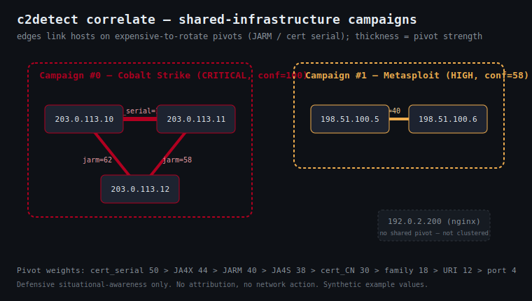
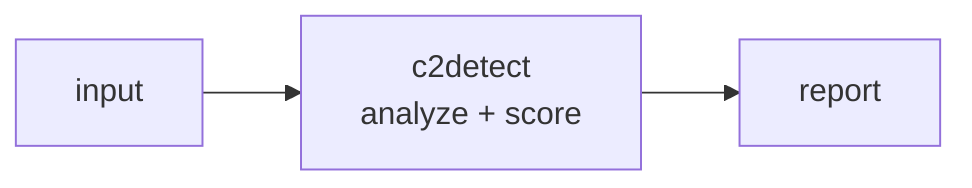

<a name="top"></a>
<div align="center">


# C2DETECT

### C2 server fingerprinter — Cobalt Strike, Sliver, Mythic, Havoc, Brute Ratel


[](https://pypi.org/project/cognis-c2detect/) [](https://github.com/cognis-digital/c2detect/actions) [](LICENSE) [](https://github.com/cognis-digital)

*Blue Team / Defensive — detect known C2 infrastructure from telemetry. Passive by default; an opt-in, authorization-gated active probe is available for hosts you are authorized to assess.*

</div>

```bash
pip install cognis-c2detect
c2detect scan .            # → prioritized findings in seconds
```

## Usage — step by step

`c2detect` is defensive C2-infrastructure triage: it scans telemetry/observation records against a bundled signature DB and flags beaconing, suspicious TLS fingerprints, and staging URIs. **It is passive by default** — `scan`/`match`/`correlate`/`db`/`rules` read input you provide and make no network calls (the optional `--feeds` only pulls public abuse.ch intel feeds, which can run fully offline from cache). A separate, **opt-in and authorization-gated** active probe (`c2detect probe`) can TLS-fingerprint a consented host you are authorized to assess — see [Passive vs. active](#passive-vs-active).

1. **Install** (Python 3.10+):
   ```bash
   pip install -e .            # or: pipx install c2detect
   ```
2. **Scan observation files / telemetry text / a directory / stdin**:
   ```bash
   c2detect scan telemetry.json
   cat telemetry.log | c2detect scan
   ```
3. **Match explicit indicators** on the command line (no file needed):
   ```bash
   c2detect match --ja4 t13d1516h2_8daaf6152771_b186095e22b6 --port 443 --beacon-interval 60 --jitter 0.1
   c2detect db        # list the bundled C2 signature database
   ```
   Or **correlate a batch** to cluster hosts that share C2 infrastructure into campaigns (see [Campaign correlation](#correlate)):
   ```bash
   c2detect correlate telemetry.json          # which hosts are one operator's estate, and why
   ```
   Add `--feeds` to any `scan`/`match` to cross-reference host IPs / JA3s against the live [abuse.ch](https://abuse.ch) Feodo-C2 + SSLBL threat-intel feeds (cached, offline-capable — see [Live threat-intel feeds](#live-threat-intel-feeds-edge--air-gap-deployable)).
4. **Read the output** in JSON / SARIF / HTML / badge (e.g. for code scanning):
   ```bash
   c2detect scan telemetry.json --format sarif > c2.sarif
   c2detect scan telemetry.json --format json | jq '.findings'
   ```
5. **Gate CI** with `--fail-on <severity>` (exit non-zero at/above that severity). Optional `--ai` adds an opt-in Cognis-fleet LLM pass that degrades to rules if no backend is configured:
   ```yaml
   - run: pip install -e . && c2detect scan telemetry.json --fail-on high
   ```


<a name="passive-vs-active"></a>
## Passive vs. active

| | Passive (default) | Active (opt-in, gated) |
|---|---|---|
| Commands | `scan` · `match` · `correlate` · `db` · `rules` | `probe` |
| Network | none (`--feeds` pulls public intel, offline-capable) | one TLS handshake + optional benign HTTP HEAD per target |
| Default | **on** | **OFF** — refuses unless explicitly enabled |
| Input | telemetry files / JSON / JSONL / text / stdin | a host:port **in an explicit allowlist** |

**Passive mode** is the safe default and the right tool for almost everything: feed it Zeek/Suricata/EDR exports (JSON, JSONL/NDJSON, or free text), IOC sightings, or a directory of captures, and it scores them against the bundled C2 signature DB. It never reaches out to the targets.

> ### ⚠️ Active mode — authorized defensive use only
>
> `c2detect probe` opens a **TLS handshake** (plus an optional, benign `HEAD /`) to a host **you are authorized to assess**, records its certificate / JARM / banner, and runs the same passive scanner on the result — effectively an authorized `openssl s_client` that fingerprints a suspected C2 team server. **It sends no payloads, runs no exploits, and takes no offensive action.**
>
> Active probing is **OFF by default**. To run a probe, **all** of the following are required, or it refuses:
>
> 1. `--authorized` — you assert you have documented authorization for every target in scope;
> 2. `--target-allowlist <host|host:port|CIDR>` (repeatable, or `--allowlist-file`) — a **mandatory** scope; any target not in it is refused and skipped;
> 3. a positive `--rate-limit` (connections/second; default `2.0`).
>
> A loud authorized-use banner is printed to stderr on every invocation. Probing a host without authorization may be illegal — you are responsible for your scope.
>
> ```bash
> # Authorized assessment of a single consented team server:
> c2detect probe teamserver.lab.example:50050 \
>     --authorized \
>     --target-allowlist teamserver.lab.example:50050 \
>     --rate-limit 1 --format json
>
> # Sweep an owned subnet from a scope file (out-of-scope hosts are skipped):
> c2detect probe 10.10.5.10 10.10.5.11 8.8.8.8 \
>     --authorized --allowlist-file scope.txt --rate-limit 2
> # → 8.8.8.8 refused (out of scope); 10.10.5.x fingerprinted + scored
> ```

## Contents

- [Why c2detect?](#why) · [Passive vs. active](#passive-vs-active) · [Features](#features) · [Quick start](#quick-start) · [Example](#example) · [Detection depth](#detection-depth) · [Campaign correlation](#correlate) · [GitHub Action](#github-action) · [Status badge](#status-badge) · [HTML report](#html-report) · [AI mode](#ai-mode) · [Architecture](#architecture) · [AI stack](#ai-stack) · [How it compares](#how-it-compares) · [Integrations](#integrations) · [Install anywhere](#install-anywhere) · [Related](#related) · [Contributing](#contributing)

<a name="why"></a>
## Why c2detect?

C2 server fingerprinter — Cobalt Strike, Sliver, Mythic, Havoc, Brute Ratel — without standing up heavyweight infrastructure.

`c2detect` is single-purpose, scriptable, and self-hostable: point it at a target, get prioritized results in the format your workflow already speaks (table · JSON · SARIF), gate CI on it, and let agents drive it over MCP.

<div align="right"><a href="#top">↑ back to top</a></div>

<a name="features"></a>
## Features

- ✅ **21 C2 families** fingerprinted — **AdaptixC2** `new`, Cobalt Strike, Metasploit, Sliver, Covenant, Mythic, Brute Ratel, Empire, Havoc, PoshC2, Merlin, Deimos, NimPlant, Villain, Caldera, Pupy, Koadic, SILENTTRINITY, Godzilla + generic self-signed/beaconing heuristics
- ✅ **TLS + behavioral indicators** — JA4 / JA4S / JA4X / JA3 / JA3S / JARM, plus **beacon-interval/jitter cadence**, checksum/encoded **URI regexes**, default **User-Agents**, cert quirks and ports
- ✅ Output: **table · JSON · SARIF · HTML report · shields.io badge**
- ✅ **Deploy as detection rules** — generate ready-to-ship **Sigma** (SIEM) and **Suricata** (IDS/IPS) rules for every C2 family straight from the signature DB: `c2detect rules --format suricata`
- ✅ **Reusable GitHub Action** (`uses: cognis-digital/c2detect@main`) — comments findings on PRs, fails CI on `--fail-on`
- ✅ **Opt-in AI mode** (`--ai`) over your local Cognis fleet — **off by default**, deterministic without it
- ✅ Runs on Linux/macOS/Windows · Docker · devcontainer · MCP server
- ✅ Polyglot core ports — Python (reference), Go, Rust, JavaScript, TypeScript, and POSIX Shell (`ports/`), each with its own tests + CI
- ✅ **Authorization-gated active probe** (`c2detect probe`) — **off by default**; TLS-fingerprints a *consented, in-scope* host (needs `--authorized` + `--target-allowlist` + a rate limit). See [Passive vs. active](#passive-vs-active)
- 🛡️ Strictly **defensive** — passive triage by default; the optional active probe is authorization-gated, scope-enforced, and sends no payloads

<div align="right"><a href="#top">↑ back to top</a></div>

<a name="quick-start"></a>
## Quick start

```bash
pip install cognis-c2detect
c2detect --version
c2detect scan .                       # scan current project
c2detect scan . --format json         # machine-readable
c2detect scan . --fail-on high        # CI gate (non-zero exit)
```

<div align="right"><a href="#top">↑ back to top</a></div>

<a name="detection-rules"></a>
## Deploy as detection rules

Don't just scan — **ship the intelligence to your stack.** `c2detect rules`
turns the bundled signature DB into deployable detection content for every C2
family, generated from the same high-confidence TLS fingerprints and documented
defaults the scanner uses.

```bash
# Sigma rules for your SIEM (one rule per C2 family, TLS-fingerprint keyed)
c2detect rules --format sigma -o c2detect.sigma.yml

# Suricata IDS/IPS rules (JA3/JA4 hash + HTTP URI/User-Agent matches)
c2detect rules --format suricata -o c2detect.rules
```

Example Suricata output:

```
alert tls any any -> any any (msg:"C2DETECT Cobalt Strike default JA3"; \
  ja3.hash; content:"a0e9f5d64349fb13191bc781f81f42e1"; \
  classtype:trojan-activity; sid:9200000; rev:1; \
  metadata:c2_family Cobalt_Strike, source c2detect, confidence high;)
```

SIDs are deterministic in the private `9.2M` range so they won't clash with
ET/Talos rule sets. Sigma rules carry stable ids, `attack.command_and_control`
tags, and per-family `c2detect.family.*` tags. Tune/threshold before production.

<div align="right"><a href="#top">↑ back to top</a></div>

<a name="example"></a>
## Example

```text
$ c2detect scan .
  [HIGH    ] C2D-001  example finding             (./src/app.py)
  [MEDIUM  ] C2D-002  another signal              (./config.yaml)

  2 findings · risk score 5 · 38ms
```

<div align="right"><a href="#top">↑ back to top</a></div>

<a name="detection-depth"></a>
## Detection depth

`c2detect` scores every observation against a bundled DB of **21 C2 families**.
Each family is a blend of *observational* indicators — nothing describes an
attack, only the out-of-the-box defaults a defender can spot:

| Indicator class | Examples |
|---|---|
| **TLS fingerprints** | JA4, JA4S, JA4X (x509), JA3, JA3S, JARM |
| **Behavioral** | beacon interval window + jitter ceiling (e.g. CS default 60s / ~0% jitter), URI checksum/encoding regexes |
| **HTTP** | default User-Agent strings, spoofed `Server` banners, default listener URIs |
| **PKI** | certificate subject/issuer/serial quirks (e.g. *“Major Cobalt Strike”*, serial `146473198`) |
| **Network** | default listener ports (weak, corroborating only) |

Confidence (0–100) is a weighted blend; two or more *strong* indicators earn a
corroboration bonus. Tune the floor with `--threshold`.

### Worked demos — `c2detect scan demos/<name>/observations.json`

Fifteen self-contained, real-use-case scenarios (each with a `SCENARIO.md`),
grounded in the documented defaults so they genuinely fire:

| Demo | Scenario |
|------|----------|
| `04-sliver-mtls` | Sliver implant over mTLS (JARM + JA4 + beacon cadence) |
| `05-havoc-demon` | Havoc "Demon" agent (`Havoc` banner + `/demon`) |
| `06-mythic-agent` | Mythic C2 (`/agent_message`) |
| `07-brute-ratel` | Brute Ratel C4 (JARM + JA3) |
| `08-adaptixc2-teamserver` | **AdaptixC2** teamserver — branded `Server: AdaptixC2` header (2025-26) |
| `09-metasploit-meterpreter` | reverse_https Meterpreter (`/INITM`) |
| `10-empire-windows` | PowerShell Empire (spoofed IIS banner) |
| `11-multi-framework-incident` | **IR:** one intrusion staging CS + Sliver + Havoc + AdaptixC2 — all four attributed |
| `12-threat-hunt-jarm-sweep` | **Threat hunt:** a JARM export where 2 of 5 egress IPs are C2, hiding among benign CDNs |
| `14-campaign-correlation` | **Correlation:** `c2detect correlate` clusters 6 hosts into 2 shared-infrastructure campaigns + 1 isolated benign host |

Plus the original `01-*`/`02-*`/`03-*` basics, mixed-frameworks, behavioral, and
benign-baseline (false-positive) scenarios.

<div align="right"><a href="#top">↑ back to top</a></div>

<a name="correlate"></a>
## Campaign correlation — `c2detect correlate`

One detection says *"this host looks like Cobalt Strike."* Correlation answers
the question that actually drives incident response: **which of your hosts are
the same operator's infrastructure, and why.**

Adversaries rotate IPs, domains and URL paths cheaply, but the *shape* of their
listener and certificate stack is expensive to change — so it leaks across the
estate. `correlate` clusters hosts that **literally share** an expensive-to-
rotate pivot (reused cert serial, JARM, JA4S/JA3S, cert CN, …), draws the
campaign graph with union-find, and shows the exact evidence inline. A lone
shared port (weight 4) never fuses two hosts; a shared JARM (40) always does.

```bash
$ c2detect correlate week_telemetry.json
== Campaign #0  [CRITICAL]  confidence=100  hosts=3  families: Cobalt Strike
   host: 203.0.113.10
   host: 203.0.113.11
   host: 203.0.113.12
   shared infrastructure pivots:
     - cert_serial (w=50): 0a1b2c3d4e5f6a7b
     - jarm (w=40): 07d14d16d21d21d07c42d41d00041d24a458a375eef0c576d23a7bab9a9fb1
     - family (w=18): cobalt strike

c2detect: 2 campaign(s) clustering 5 host(s) by shared C2 infrastructure.
```

```bash
c2detect correlate obs.json --format json                 # machine-readable campaigns + edges
c2detect correlate obs.json --format dot | dot -Tsvg -o g.svg   # Graphviz pivot graph
c2detect correlate obs.json --fail-on critical            # CI gate (exit 2)
c2detect correlate obs.json --edge-floor 38               # only JARM-class pivots link
c2detect correlate obs.json --include-singletons          # full inventory incl. lone hosts
```

It does **not** attribute to a named actor and invents nothing — every reported
pivot is a value two observations actually share. Full threat context, the
weighting model, and a worked walkthrough are in
**[docs/CORRELATION.md](docs/CORRELATION.md)**.



<div align="right"><a href="#top">↑ back to top</a></div>

<a name="github-action"></a>
## GitHub Action

Scan telemetry in CI, comment findings on the PR, and fail on a severity floor —
drop this into any repo as `.github/workflows/c2detect.yml`:

```yaml
name: c2detect
on: [push, pull_request]
permissions:
  contents: read
  pull-requests: write     # to comment findings on PRs
  security-events: write   # to upload SARIF
jobs:
  scan:
    runs-on: ubuntu-latest
    steps:
      - uses: actions/checkout@v4
      - uses: cognis-digital/c2detect@main
        with:
          path: telemetry/        # file or dir to scan
          format: sarif           # table | json | sarif | html | badge
          fail-on: high           # fail the build at/above this severity
          threshold: "35"         # min confidence to report
          comment-pr: "true"      # post a findings comment via gh api
```

The action uploads a **SARIF + HTML** report artifact and exposes
`steps.<id>.outputs.findings` and `steps.<id>.outputs.badge`.

<div align="right"><a href="#top">↑ back to top</a></div>

<a name="status-badge"></a>
## Status badge

`--format badge` prints a [shields.io endpoint](https://shields.io/endpoint)
JSON you can host and reference:

```bash
c2detect scan telemetry/ --format badge > badge.json
# {"schemaVersion":1,"label":"c2detect","message":"clean","color":"brightgreen"}
```

```md

```

<div align="right"><a href="#top">↑ back to top</a></div>

<a name="html-report"></a>
## HTML report

```bash
c2detect scan telemetry/ --format html > report.html   # clean, self-contained
```

A single self-contained HTML file (no external assets) with per-host findings,
severity pills, indicator breakdown, and any AI-suggested candidates.

<div align="right"><a href="#top">↑ back to top</a></div>

<a name="ai-mode"></a>
## AI mode (opt-in, off by default)

Add `--ai` to layer a local-fleet LLM pass over the **same** source the scanner
already processed. AI findings are merged in, tagged `source="ai"`, novel
candidates flagged, and **deduped** against the deterministic rule findings:

```bash
# Point at a LOCAL OpenAI-compatible endpoint (nothing leaves the box):
export COGNIS_AI_BACKEND=uncensored-fleet     # or COGNIS_AI_ENDPOINT=http://127.0.0.1:8774/v1
c2detect scan telemetry/ --ai
```

Guarantees:

- **Off by default.** Without `--ai`, output is **byte-for-byte deterministic** and contains no AI keys.
- **Never crashes.** If `--ai` is given but no backend is configured, or the backend is unreachable, `c2detect` prints a clear note and continues with the rule findings only.
- **Local-first.** Honors `COGNIS_AI_BACKEND` / `COGNIS_AI_ENDPOINT` / `COGNIS_AI_MODEL` / `COGNIS_AI_KEY` — designed for the [uncensored-fleet](https://github.com/cognis-digital/uncensored-fleet) and `cognis-code` local endpoints.

<div align="right"><a href="#top">↑ back to top</a></div>

## Live threat-intel feeds (edge / air-gap deployable)

The bundled signature DB catches the *default* fingerprints of known C2
frameworks. `--feeds` adds a complementary signal: it cross-references every
observation against **real, public, keyless** [abuse.ch](https://abuse.ch)
threat-intel feeds, so a host that is already *known* malicious is flagged even
when its TLS profile has been customised away from a documented default.

Two feeds are wired (c2detect's domain is threat-intel — the catalog is
filtered so only these surface):

| feed id | source | what it adds |
|---|---|---|
| `feodo-c2` | [Feodo Tracker C2 IP blocklist](https://feodotracker.abuse.ch/downloads/ipblocklist.json) | observation **host IP** on the active-botnet C2 list → **CRITICAL** hit (Emotet/Dridex/QakBot/…) |
| `sslbl` | [SSLBL malicious JA3 fingerprints](https://sslbl.abuse.ch/blacklist/ja3_fingerprints.csv) | observation **JA3** on the malicious-fingerprint blacklist → **HIGH** hit |

```bash
c2detect feeds list                 # the feeds c2detect consumes + cache age
c2detect feeds update               # fetch + cache them (online)
c2detect feeds get feodo-c2         # inspect parsed indicators

# Enrich a scan. A feed hit at/above --fail-on severity also trips the CI gate.
c2detect scan telemetry.json --feeds
c2detect scan telemetry.json --feeds --fail-on critical
```

### Edge / air-gap (offline + snapshot)

Feeds are fetched over HTTPS once, cached to disk
(`COGNIS_FEEDS_CACHE`, default `~/.cache/cognis-feeds`), and re-served with
`--offline` so c2detect keeps working on a disconnected / military / edge box.
To move intel across an air gap, sneakernet the cache:

```bash
# Connected host: refresh + pack.
c2detect feeds update
python -m c2detect.datafeeds snapshot-export feeds.tar.gz

# Air-gapped enclave: import + run with zero network.
python -m c2detect.datafeeds snapshot-import feeds.tar.gz
c2detect scan obs.json --feeds --offline
```

`--feeds` never crashes the scan: if the cache is missing while `--offline`, or
a feed is unreachable while online, c2detect prints a note and continues with
the deterministic rule findings. See **`demos/13-threat-intel-feeds/`** for a
pre-seeded snapshot you can run offline immediately.

<div align="right"><a href="#top">↑ back to top</a></div>

<a name="architecture"></a>
## Architecture



<div align="right"><a href="#top">↑ back to top</a></div>

<a name="ai-stack"></a>
## Use it from any AI stack

`c2detect` is interoperable with every popular way of using AI:

- **MCP server** — `c2detect mcp` (Claude Desktop, Cursor, Cognis.Studio, [uncensored-fleet](https://github.com/cognis-digital/uncensored-fleet))
- **OpenAI-compatible / JSON** — pipe `c2detect scan . --format json` into any agent or LLM
- **LangChain · CrewAI · AutoGen · LlamaIndex** — wrap the CLI/JSON as a tool in one line
- **CI / scripts** — exit codes + SARIF for non-AI pipelines

<div align="right"><a href="#top">↑ back to top</a></div>

<a name="how-it-compares"></a>
## How it compares

| | **Cognis c2detect** | salesforce |
|---|:---:|:---:|
| Self-hostable, no account | ✅ | varies |
| Single command, zero config | ✅ | ⚠️ |
| JSON + SARIF for CI | ✅ | varies |
| MCP-native (AI agents) | ✅ | ❌ |
| Polyglot ports (JS/Go/Rust) | ✅ | ❌ |
| Open license | ✅ COCL | varies |

*Built in the spirit of **salesforce/jarm**, re-framed the Cognis way. Missing a credit? Open a PR.*

<div align="right"><a href="#top">↑ back to top</a></div>

<a name="integrations"></a>
## Integrations

Pipes into your stack: **SARIF** for code-scanning, **JSON** for anything, an **MCP server** (`c2detect mcp`) for AI agents, and a webhook forwarder for SIEM/Slack/Jira. See [`docs/INTEGRATIONS.md`](docs/INTEGRATIONS.md).

<div align="right"><a href="#top">↑ back to top</a></div>

<a name="install-anywhere"></a>
## Install — every way, every platform

```bash
pip install "git+https://github.com/cognis-digital/c2detect.git"    # pip (works today)
pipx install "git+https://github.com/cognis-digital/c2detect.git"   # isolated CLI
uv tool install "git+https://github.com/cognis-digital/c2detect.git" # uv
pip install cognis-c2detect                                          # PyPI (when published)
docker run --rm ghcr.io/cognis-digital/c2detect:latest --help        # Docker
brew install cognis-digital/tap/c2detect                             # Homebrew tap
curl -fsSL https://raw.githubusercontent.com/cognis-digital/c2detect/main/install.sh | sh
```

| Linux | macOS | Windows | Docker | Cloud |
|---|---|---|---|---|
| `scripts/setup-linux.sh` | `scripts/setup-macos.sh` | `scripts/setup-windows.ps1` | `docker run ghcr.io/cognis-digital/c2detect` | [DEPLOY.md](docs/DEPLOY.md) (AWS/Azure/GCP/k8s) |

**Drop the core check into any stack** — the JARM/JA3/port/URI scorer is ported to Go, Rust, JavaScript, TypeScript, and POSIX Shell (each with its own tests + CI) under [`ports/`](ports/README.md):

```bash
node ports/javascript/index.js obs.json          # JavaScript
node --experimental-strip-types ports/typescript/index.ts obs.json   # TypeScript
cd ports/go && go run . obs.json                  # Go
cd ports/rust && cargo run -- obs.json            # Rust
sh ports/shell/c2detect.sh obs.json               # POSIX shell
```

<div align="right"><a href="#top">↑ back to top</a></div>

<a name="related"></a>
## Related Cognis tools

- [`payloadlab`](https://github.com/cognis-digital/payloadlab) — Static malicious payload analyzer — PE/ELF/LNK/macro/OneNote
- [`redpath`](https://github.com/cognis-digital/redpath) — Active Directory attack path mapper — minimum-cost paths + remediation priority
- [`pwnreview`](https://github.com/cognis-digital/pwnreview) — Pentest report generator — YAML findings to CREST-grade PDF
- [`crackq`](https://github.com/cognis-digital/crackq) — Self-hosted password cracking queue — multi-user hashcat with audit log

**Explore the suite →** [🗂️ all 170+ tools](https://github.com/cognis-digital/cognis-neural-suite) · [⭐ awesome-cognis](https://github.com/cognis-digital/awesome-cognis) · [🔗 cognis-sources](https://github.com/cognis-digital/cognis-sources) · [🤖 uncensored-fleet](https://github.com/cognis-digital/uncensored-fleet) · [🧠 engram](https://github.com/cognis-digital/engram)

<div align="right"><a href="#top">↑ back to top</a></div>

<a name="contributing"></a>
## Contributing

PRs, new rules, and demo scenarios are welcome under the collaboration-pull model — see [CONTRIBUTING.md](CONTRIBUTING.md) and [SECURITY.md](SECURITY.md).

> ### ⭐ If `c2detect` saved you time, **star it** — it genuinely helps others find it.

## Interoperability

`{}` composes with the 300+ tool Cognis suite — JSON in/out and a shared
OpenAI-compatible `/v1` backbone. See **[INTEROP.md](INTEROP.md)** for the
suite map, composition patterns, and reference stacks.

## License

Source-available under the **Cognis Open Collaboration License (COCL) v1.0** — free for personal, internal-evaluation, research, and educational use; **commercial / production use requires a license** (licensing@cognis.digital). See [LICENSE](LICENSE).

---

<div align="center"><sub><b><a href="https://cognis.digital">Cognis Digital</a></b> · one of 170+ tools in the <a href="https://github.com/cognis-digital/cognis-neural-suite">Cognis Neural Suite</a> · <i>Making Tomorrow Better Today</i></sub></div>
