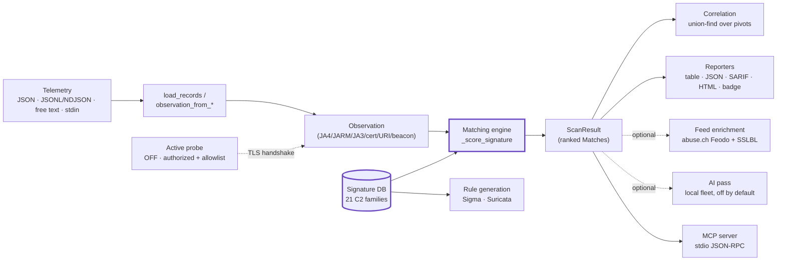
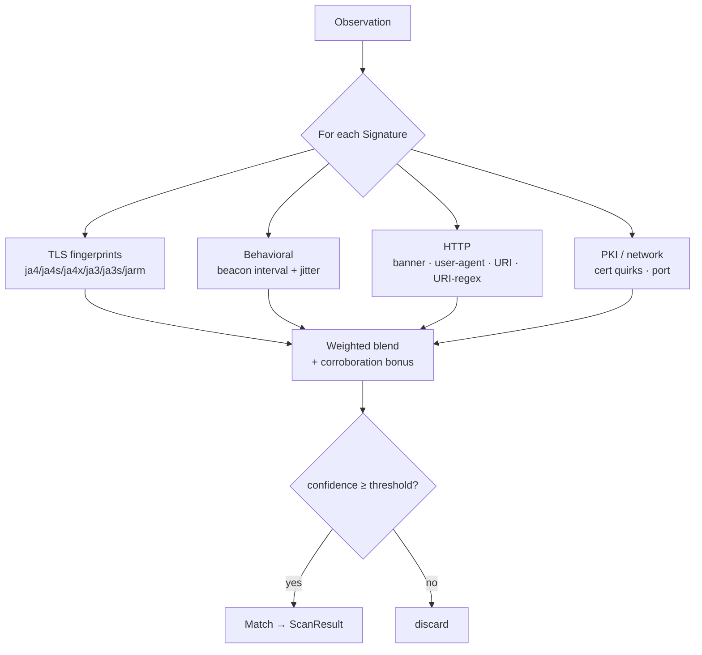

# C2DETECT — Architecture

`c2detect` fingerprints known **Command-and-Control (C2)** infrastructure from
telemetry, generates deployable detection rules, and clusters hosts into
shared-infrastructure campaigns — passively, offline, with no third-party
dependencies. This document explains how the pieces fit together, end to end.

> **Defensive / authorized-triage only.** The core is *passive*: it reads
> observations you provide and scores them. The single active capability
> (`probe`) is **off by default** and authorization-gated. See
> [Passive vs. active](../README.md#passive-vs-active).

## The pipeline

## Components

### Signature database (`c2detect/core.py` · `_DB`)
The heart of the tool: a bundled tuple of `Signature` objects, one per C2
family (21 today — Cobalt Strike, Metasploit, Sliver, Covenant, Mythic, Brute
Ratel, Empire, Havoc, PoshC2, Merlin, Deimos, NimPlant, Villain, Caldera, Pupy,
Koadic, SILENTTRINITY, Godzilla, AdaptixC2, plus generic beaconing/self-signed
heuristics). Every field is **observational** — JA4/JA4S/JA4X/JA3/JA3S/JARM TLS
fingerprints, default ports/URIs, URI regexes, HTTP banners, default
User-Agents, cert quirks, and a beacon-cadence window. These are the
out-of-the-box defaults operators are *told to change* — which is exactly why
detecting them is useful. `signatures()` exposes the raw DB; `list_signatures()`
returns the inventory.

### Observation ingest (`observation_from_record` · `observation_from_text` · `load_records`)
Real-world exports rarely match one schema, so ingest is tolerant:
`load_records` accepts a bare JSON list, an object with an `observations`/
`records`/`hosts` array, a single object, or **JSONL/NDJSON** (one object per
line, as Zeek/Suricata/EDR emit). `observation_from_record` maps a wide set of
field aliases (`ip`/`dest_ip`/`server` → host, `dst_port` → port, …) onto the
canonical `Observation`. `observation_from_text` harvests fingerprints and URIs
out of a free-text telemetry blob.

### Matching engine (`_score_signature` · `scan_observation` · `scan_observations`)
Each observation is scored against every signature. Indicator classes carry
weights (JA4/JARM are decisive; ports are weak, corroborating only); the
confidence is the capped sum of distinct matched classes, with a corroboration
bonus when two or more *strong* indicators agree. Matches at/above the threshold
(default 35) are returned in a `ScanResult`, ranked confidence-first.

### Correlation engine (`c2detect/correlate.py`)
A single detection says "this host looks like Cobalt Strike." Correlation
answers "which hosts are *one operator's* estate." It reduces each `ScanResult`
to infrastructure pivots (reused cert serial, JARM, JA4S/JA3S, cert CN, family,
URI, beacon cadence, …), draws an edge between two hosts when their **shared**
pivot weight clears the edge floor, and clusters connected components with
union-find (`_DSU`). A lone shared port (weight 4) never fuses hosts; a shared
JARM (40) always does. Output: ranked `Campaign` objects carrying the exact
evidence, rendered to table / JSON / Graphviz DOT.

### Reporters (`core.to_sarif` · `to_html` · `to_badge`; `correlate.to_json`/`to_table`/`to_dot`)
Scan results render to a console table, machine-readable **JSON**, **SARIF
2.1.0** (GitHub code-scanning compatible), a self-contained **HTML** report, and
a **shields.io** status badge. `worst_severity` / `fails_gate` drive the
`--fail-on` CI gate.

### Rule generation (`c2detect/rules.py`)
Turns the same signature DB into deployable detection content: **Sigma** (one
vendor-neutral SIEM rule per family, keyed on TLS fingerprints with stable
UUIDs and `attack.command_and_control` tags) and **Suricata** (IDS/IPS rules on
JA3/JA4 hashes + HTTP URI/User-Agent, with deterministic SIDs in the private
`9.2M` band so they won't clash with ET/Talos).

### Feed enrichment (`c2detect/feeds.py` · `datafeeds.py`)
An optional, complementary signal: cross-reference each observation's host IP
and JA3 against the real, public, keyless **abuse.ch** Feodo Tracker (active C2
IPs) and SSLBL (malicious JA3) feeds. Feeds are fetched over HTTPS once, cached
to disk, and re-served with `offline=True` — so it runs on a disconnected /
air-gapped enclave, and the cache can be sneakernetted via
`datafeeds snapshot-export/-import`.

### Self-check (`c2detect/selfcheck.py`)
Scans every bundled `demos/NN-*/` scenario, confirms each malicious one fires
and the benign baseline stays quiet, classifies feeds/correlation demos as
informational, and exits non-zero if coverage regresses — a CI-ready proof of
the DB's coverage.

### MCP server (`c2detect/mcp_server.py`) and emit (`c2detect/connect.py`)
`c2detect mcp` serves the scanner to AI agents over stdio JSON-RPC.
`c2detect-emit` maps the JSON output to the canonical `cognis-connect` `Finding`
and forwards it to STIX/MISP/Sigma/Splunk/Elastic/Slack/webhook.

### Active probe (`c2detect/active.py`)
The one outbound capability, **off by default**. With `--authorized`, a
mandatory `--target-allowlist`, and a rate limit, it opens a single TLS
handshake (plus optional benign `HEAD /`) to a consented host, records its
cert/JARM/banner, and runs the *same* passive scanner on the result. It sends no
payloads and takes no offensive action.

## Why these choices

- **Standard library only, no network in the core.** The scanner is a pure
  function over data you provide; nothing leaves the box. Easy to vendor, audit,
  and run on an air-gapped enclave.
- **Observational signatures, not exploits.** Every indicator is a documented
  default a defender can spot — the DB describes *detection*, never *operation*.
- **Deterministic by default.** Without `--ai`, output is byte-for-byte
  reproducible; the optional AI pass is local-first and degrades to rules.
- **Evidence in, evidence out.** Correlation reports only pivots two hosts
  literally share and attributes to no named actor — it invents nothing.
